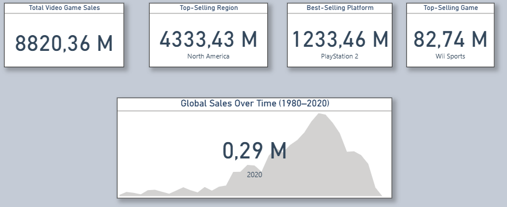
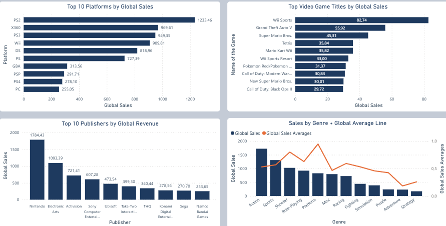
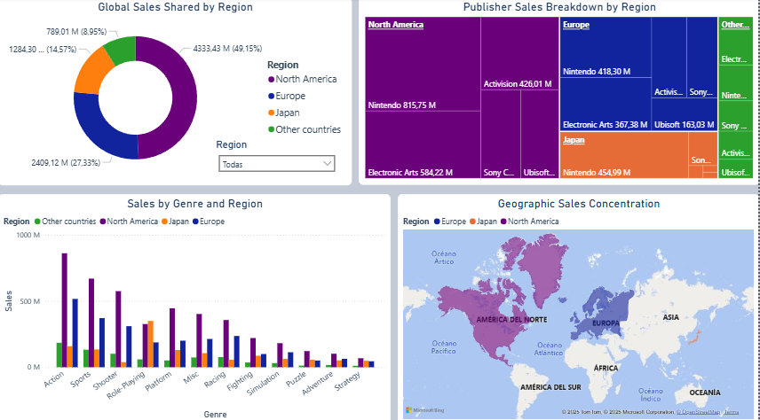
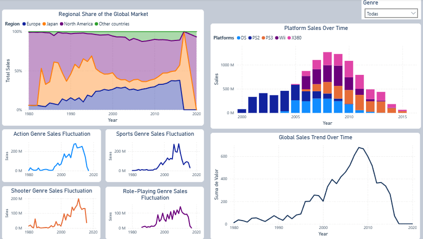
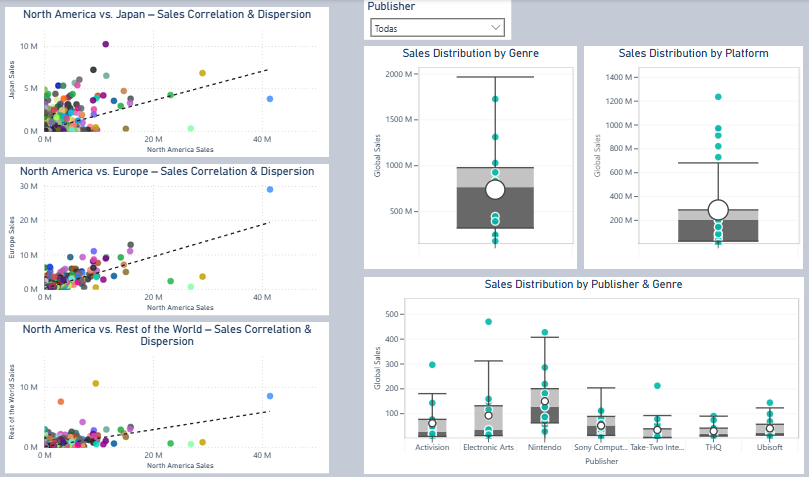
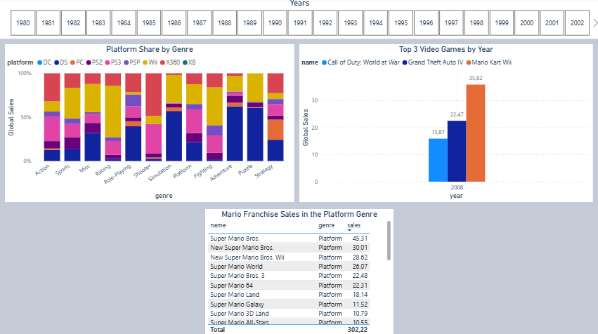

# Análisis de Ventas Globales de Videojuegos (1980–2020)

## 📑 Tabla de Contenido
1. [Objective / Objetivo](#1-objective--objetivo)  
2. [Executive Summary / Resumen Ejecutivo](#2-executive-summary--resumen-ejecutivo)  
3. [Worldwide Insights / Perspectivas Globales](#3-worldwide-insights--perspectivas-globales)  
4. [Regional Breakdown / Desglose Regional](#4-regional-breakdown--desglose-regional)  
5. [Trends Over Time / Tendencias a lo Largo del Tiempo](#5-trends-over-time--tendencias-a-lo-largo-del-tiempo)  
6. [Variability & Outliers / Variabilidad & Valores Atípicos](#6-variability--outliers--variabilidad--valores-atípicos)  
7. [Conclusions & Recommendations / Conclusiones & Recomendaciones](#7-conclusions--recommendations--conclusiones--recomendaciones)
8. [Additional Insights / Insights Adicionales](#8-additional-insights--insights-adicionales)

## 1. Objective / Objetivo
El objetivo principal de este informe es analizar exhaustivamente las ventas globales de videojuegos entre 1980 y 2020, identificando patrones y tendencias clave por región, plataforma, género y franquicia, para extraer insights accionables que respalden decisiones estratégicas de producto, marketing y expansión de mercado.

## 2. Executive Summary / Resumen Ejecutivo
  

- **Total Video Game Sales / Ventas Totales en Videojuegos:** En total se han vendido 8820.36 millones de unidades de videojuegos en el mundo, desde 1980 hasta el         año 2020.  
- **Top‑Selling Region / Región Con Más Ventas:** Norte América es la región con más ventas en la historia de la industria de videojuegos, con 4333.43 millones de unidades; lo cual representa el 49.15 % de las ventas mundiales.
- **Best‑Selling Platform / Plataforma Con Más Ventas:** PlayStation 2 es la plataforma que más a vendido a lo largo de la historia, con 1233.46 M .
- **Top‑Selling Game / Juego Más Vendido:** El juego más vendido en la historia es Wii Sports (82.74 M), lanzado en el año 2006  
- **Global Sales Over Time (1980-2020) / Ventas Mundiales a lo Largo del Tiempo (1980-2020):** El pico más alto de ventas fue en 2008 con 678.9 millones de unidades.

## 3. Worldwide Insights / Perspectivas Globales
  

**Top 10 Platforms by Global Sales / Top 10 Plataformas con Más Ventas Globales**  
- La plataforma con más ventas en la historia es PlayStation 2 (1233.46 M), en el segundo y tercer puesto se encuentran X360 (969.61 M) y   PlayStation 3 (949.35 M).
- También en el puesto 6, 8 y 9 se encuentran PlayStation, PlayStation Portable, y PlayStation 4, respectivamente; conviertiendo a PlayStation en la empresa que más consolas tiene en este top 10.

**Top Video Game Titles by Global Sales / Videojuegos Con Más Ventas Mundiales**
- El primer puesto se lo lleva Wii Sports con 82.74 M de unidades vendidas, sacando una diferencia considerable al segundo puesto (Grand Theft Auto V - 55.92 M).
- El 70% de los juegos en este top son de Nintendo.
- Take-Two-Interactive y Activision acompañan a Nintendo en el top, con 1 y 2 juegos, respectivamente.

**Top 10 Publishers by Global Revenue / Top 10 Publishers Con Más Ventas Globales**
- El podio queda de la siguiente manera: El primer puesto lo ocupa Nintendo con 1784.43 M, el segundo puesto es ocupado por Electronic Arts (1093.39 M), y el tercer puesto por Activision (721.41 M).
- El 41.44% de las ventas de Nintendo corresponden a las plataformas DS y Wii.
- El 54.68% de las ventas de Electronic Arts corresponden a la linea de consolas de la empresa PlayStation.

**Sales by Genre + Global Average Line / Ventas por Genero + Linea de Promedios de Ventas**
- El primer lugar se lo lleva el género Action con ventas de 1722.88 millones de unidades (el 19.53% de ventas globales).
- El genero Platform es el que tiene el promedio de ventas más altas (0.95 M), teniendo en cuenta que ocupa el puesto 5 de generos con más ventas.
- Hasta el 2004 el genero con más ventas había sido Platform, impulsado por el auge de la franquicia Mario; la cual representa el 36.44%   de las ventas de este genero.

  **Metodología**  
   Para complementar este analisis, además de los gráficos que se ven en pantalla, usé:
  - Gráfico: Tabla
  - Columnas: name, genre, sales
  

## 4. Regional Breakdown / Desglose Regional
  

**Global Sales Shared by Region / Ventas Globales Compartidas por Región**  
- Norte América representa practicamente la mitad de las ventas historicas mundiales de la industria del gaming con el 49.15%.
- Europa, Japón, y el resto del mundo representan el 27.33%, 14.57% y 8.95% de las ventas historicas, respectivamente.

**Publisher Sales Breakdown by Region / Distribución de Ventas de los Publishers por Región**
- Los publishers que más vendieron en Norte America y Europa fueron: Nintendo, Electronic Arts, Activision, Sony Computer Entertainment y   Ubisoft (en ese mismo orden en ambas regiones). Esto muestra lo parecidos que son estos dos mercados.
- En Japón los 5 publishers que más vendieron fueron: 1. Nintendo, 2. Namco Badai Games, 3. Konami Digital Entertainment, 4. Sony           Computer Entertainment, y 5. Capcom. Se observa la fuerte inclinación hacía los publishers locales.
- En el resto del mundo es como en Europa y Norte America, con la diferencia que el primer puesto se lo lleva Electronic Arts, y está       Take-Two Interactive en lugar de Ubisoft.

**Sales by Genre and Region / Ventas por Genero y Región**
- Norte America es la región con más ventas en cada genero, con excepción del genero Role-Playing donde es Japón quién lidera.
- El genero que menos gusta a los japoneses es el genero Shooter, a pesar de que este es el tercer genero con más ventas mundiales.
- El genero que más gusta a Europa, Norte America y el resto del mundo es Action, en Japón es Role-Playing. Por otra parte, Strategy es     el genero con menos ventas en Europa, Norte America y el resto del mundo.

## 5. Trends Over Time / Tendencias a lo Largo del Tiempo
  

**Regional Share of the Global Market / Participación Regional en el Mercado Global**  
- Japón y Norte America estuvieron disputandose el primer puesto desde 1980 hasta 1995.
- De 1996 hasta 2015 Norte America fue la región con más ventas en cada año.
- Europa desde 1997 en adelante tomó el segundo puesto, superando a Japón; y en 2016 fue su mejor año, ocupando el primer lugar con una participación en el    mercado de 37.76%, dejando a Norte America en segundo puesto con 31.97%. 

**Platform Sales Over Time / Ventas de las Plataformas a lo Largo del Tiempo**
- Las 5 plataformas con más ventas en la historia fueron lanzadas desde el año 2000 en adelante.
- PlayStation 2 fue la consola más vendida desde el 2000 hasta el 2005.
- En 2006 fue el lanzamiento del Nintendo Wii, ese mismo año fue la consola más vendida; también lo sería en el 2007, 2008 y 2009.
- El Xbox 360 y el PlayStation 3 fueron estrenados en los años 2005 y 2006, respectivamente. Xbox 360 fue la plataforma más vendida en el
  2010 y 2015, y PlayStation 3 del 2011 al 2014. 
- DS, la cual se estrenó en el 2004, alcanzó su pico más alto en el 2007; logrando ventas de 298.38 millones.

**Sales Fluctuation of the Four Best-Selling Genres / Fluctuación de Ventas de los 4 Generos Más Vendidos**
- Los picos de ventas más altos de estos generos (Action, Sports, Shooter, y Role-Playing) generalmente se encuentran en el rango de los años 2005 - 2011, la epoca dorada de la         industria del gaming.
- Las lineas de tendencia empiezan a incrementarse a partir del año 2000, una de las causas de esto es la llegada del PlayStation 2. El cual en el 2005 ya representaba el 36.23% de las ventas del género Action, 37.63% de las ventas de Sports, 30.07% de Shooter, y 17.4% de Role-Playing.
- Sports: Sus picos más altos de ventas fueron en los años 2006 y 2009, esto altamente influenciado por el lanzamiento del Nintendo Wii en 2006; el cual en solo 3 años después, ya         representaba el 25% de las ventas historicas de este género. Y a eso se le suma el exito de juegos como Wii Sports en 2006, y Wii Sports Resort y Wii Fit Plus en 2009.
- Shooter: Del 2007 al 2015 fueron los años que más ventas tuvo, esto evidentemente por la franquicia Call of Duty, la cual estuvo durante esos 9 años consecutivos dentro del top 3 de juegos más vendidos en el mundo.
- Role-Playing: Incluso desde 1996 ya venía con una tendencia al alza debido a la gran popularidad de Pokemon a finales de los 90's.
- Action: Tuvo su pico más alto en 2009, a pesar de que en ese año no hubieron hits del genero acción. Sin embargo contaba con una gran variedad de juegos que tuvieron buenos numeros      ese año, haciendo que se eleve el total de ventas.

  **Metodología**  
  Para complementar estos analisis, además de los gráficos que acabas de ver, usé: 
  Gráfico 1: Gráfico de columnas 100% apiladas
  - Leyenda: platform
  - Eje X: genre
  - Eje Y: Suma de Global Sales
  - Segmentación de datos (slicer): year
  
  Grafico 2: Grafico de columnas agrupadas 
  - Leyenda: name
  - Eje X: year
  - Eje Y: Suma de Global Sales
  - Segmentación de datos (slicer): year

**Global Sales Trend Over Time / Tendencia de Ventas Globales a Través del Tiempo**
- En los primeros años las ventas eran relativamente bajas, pues la industria aún era nueva y no tenía tanta popularidad.
- Epoca dorada: los mejores años fueron entre 2005 y 2011, alcanzando ventas de 678.49 millones de unidades en un solo año (2008).
- Del 2015 en adelante las ventas disminuyeron de manera significativa, pasando de 264.26 M en 2015 a 70.87 M en 2016. Esto pudo ser causado por la llegada de juegos móviles y los         juegos free-to-play (como PUBG Mobile, Candy Crush, etc).

## 6. Variability & Outliers / Variabilidad & Valores Atípicos
  

**North America vs. Japan – Sales Correlation & Dispersion / Norte America vs Japón - Dispersión y Correlación de Ventas**  
- Los puntos están dispersos y no siguen una linea recta: esto quiere decir que no hay correlación o que la correlación es debil entre las ventas en Norte      America y las ventas en Japón. Diciendolo de otra manera, hay juegos que aunque fueron un exito en Japón, no fueron tan populares en      Norte America (Ej: Pokemon Red/Pokemon Blue, Pokemon Diamond/Pokemon Pearl, entre otros), y viceversa (Duck Hunt, Wii Sports, entre        otros juegos).
- Algunas de las causas de esta baja correlación puede deberse a diferencias culturales, los japoneses muestran un claro favoritismo por    los juegos de Role-Playing, mientras que los norte americanos tienen gustos más variados y una inclinación hacia el genero Shooter.

**North America vs. Europe – Sales Correlation & Dispersion / Norte America vs Europa - Dispersión y Correlación de Ventas**
- Estas dos regiones muestran una mayor correlación. Los puntos tienden a estar cerca de la linea de tendencia, a excepción de unos     cuantos outliers.
- Observamos que hay una similitud entre los gustos de estas dos regiones. En general, los juegos que fueron un exito en Norte America,     también fueron un exito en Europa.

**North America vs. Rest of the World – Sales Correlation & Dispersion / Norte America vs El Resto del Mundo - Dispersión y Correlación de Ventas**
- Hay mayor correlación que en Japón pero menos que en Europa.
- Hay más cantidad de outliers, como por ejemplo Duck Hunt, el cual fue un punto atipico en los 3 graficos; esto da a entender que solo     tuvo popularidad en la región Norteamericana. Algunas de las causas pudieron ser temas culturales, como vimos en analisis anteriores,     los norteamericanos tienen una inclinación por los juegos del género Shooter, mientras que regiones como Japón prefieren los juegos de        Role-Playing y Platform.

**Sales Distribution by Genre / Distribución de Ventas por Genero**
- Con un rango intercuartilico (IQR) de 658.83 y un rango total de 1549.45, el rango intecuartilico representa el 42.46% del rango total    (658/1549.45=0.4246). Esto nos dice que hay una alta dispersión central en las ventas de los generos.
- No hay ventas que sean consideradas atipicas, todos los puntos (las ventas por generos) están dentro de los limites del boxplot. Es       decir, que aunque hubieron ventas muy altas (Action: 1722.48 M), son consideradas como ventas que están dentro de la
  variabilidad esperada.
- La media (735.03) es ligeramente menor que la mediana (762.19), esto ocurre porque hubieron varias ventas con valores muy bajos
  que 'jalaron' la media hacia abajo.

**Sales Distribution by Platform / Distribución de Ventas por Plataforma**
- Hay 6 puntos fuera de los bigotes del boxplot, estos valores atipicos (1233.46 M, 969.61 M, etc) son ventas que fueron un gran exito y    rompieron el mercado. Son ventas que superan por mucho el limite del bigote superior (679.01 M).
- La media (284.53) es considerablemente mayor que la mediana (200.05), esto se debe a los outliers que atrajeron la media hacía arriba     (PS2: 1233.46, X360: 969.61, etc).
- El 75% de las ventas de las plataformas son menor igual a 284.90 (Q3), lo que refleja el contraste de las ventas que son muy altas 
  (1233.46, 969.61, etc) con otras muy bajas (0.03, 0.1, etc).

**Sales Distribution by Publisher & Genre / Distribución de Ventas por Publisher y Género**
- Las ventas de generos como Action, Sports, Shooter, entre otros, fueron consideradas atipicas por algunos publishers debido al gran       exito que tuvieron.
- Sony Computer Entertainment: Median = Mean. Esto indica que la distribución es simetrica; además, la mitad de los valores cubren el 70%   del rango total (IQR/Rango total = 0.7). Esto quiere decir que la dispersión central de las ventas es muy amplia.
- Con excepcion de Sony Computer Entertainment, todos los publishers de este top tienen una media mayor a la mediana, lo que refleja una    asimetría en sus boxplots, causada por ventas bastante altas.

## 7. **Conclusions & Recommendations / Conclusiones & Recomendaciones**

Conclusiones:  

Tras examinar más de 8 800 millones de unidades vendidas y analizar múltiples perspectivas (regional, temporal, por género y plataforma), destacamos:
- Norteamérica domina el 49.15% de las ventas mundiales, seguida por Europa con 27.33 % y Japón con 14.57 %.
- PlayStation 2 es la consola más exitosa de la historia, con 1233.46 M unidades; el 13.98% del total de ventas historicas.
- El género Action lidera con el 19.53 % de los ingresos, mientras que Role-Playing crece de forma constante gracias a franquicias como Pokémon.
- El pico de ventas globales (678.9 M unidades) se alcanzó en 2008; desde 2016 existe un declive asociado al auge de los juegos móviles.
- La dispersión de ventas en las diferentes regiones, tienen coeficientes de variación mayores al 300%, lo que revela una industria polarizada: pocos títulos “mega-éxitos” contra una larga cola de juegos de rendimiento moderado.

Recomendaciones:
- Priorizar el desarrollo y marketing de géneros y regiones de mayor crecimiento.
- Replicar modelos de negocio de títulos con bajo grado de variabilidad y buenas ventas.
- Implementar modelos predictivos que anticipen ventas por mercado y plataforma.
Con esto, las decisiones estratégicas se basan en datos precisos, favoreciendo inversiones de alto impacto.

## 8. Additional Insights / Insights Adicionales

Gráficos suplementarios que aportan un contexto extra a los análisis previos:  

  

**Platform Share by Genre / Participación de las Plataformas por Género**  

Este gráfico muestra cuanta participación tuvo cada plataforma dentro de cada género en cada año. Se hizo con el fin de complementar el análisis de las gráficas: *Sales Fluctuation of the Four Best-Selling Genres / Fluctuación de Ventas de los 4 Generos Más Vendidos*.  
Especificamente se usó para saber que porcentaje de ventas representaba PlayStation 2 en los diferentes géneros, y que porcentaje representaba Nintendo Wii en el género Sports.

**Top 3 Video Games by Year**  
Este gráfico muestra el top 3 de juegos más vendidos por año.
También se usó para complementar los análisis de las gráficas: *Sales Fluctuation of the Four Best-Selling Genres / Fluctuación de Ventas de los 4 Generos Más Vendidos*.  
Sirvió para identificar que la franquicia Call Of Duty estuvo desde el 2007 hasta el 2015 dentro del top 3 de juegos más vendidos en el mundo.

**Mario Franchise Sales in the Platform Genre / Ventas de la Franquicia Mario en el Género Platform**  
Esta tabla se usó para complementar el análisis de la gráfica: *Sales by Genre + Global Average Line / Ventas por Genero + Linea de Promedios de Ventas*.  
Por medio de esta tabla vimos que la franquicia Mario representa el 36.44% de las ventas del género Platform.

