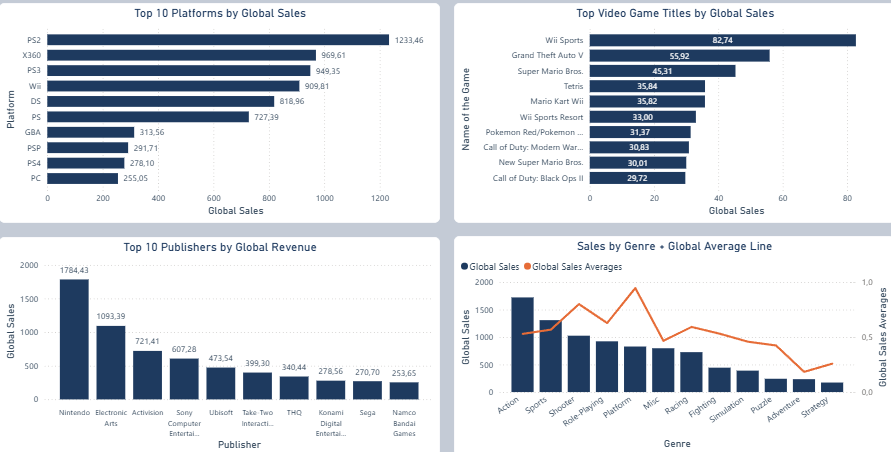
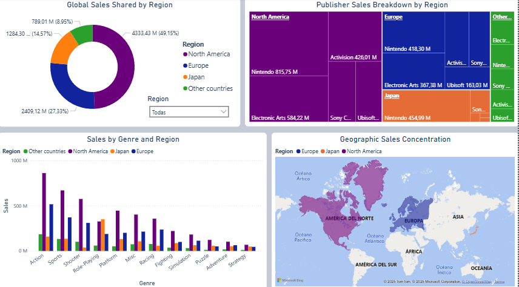
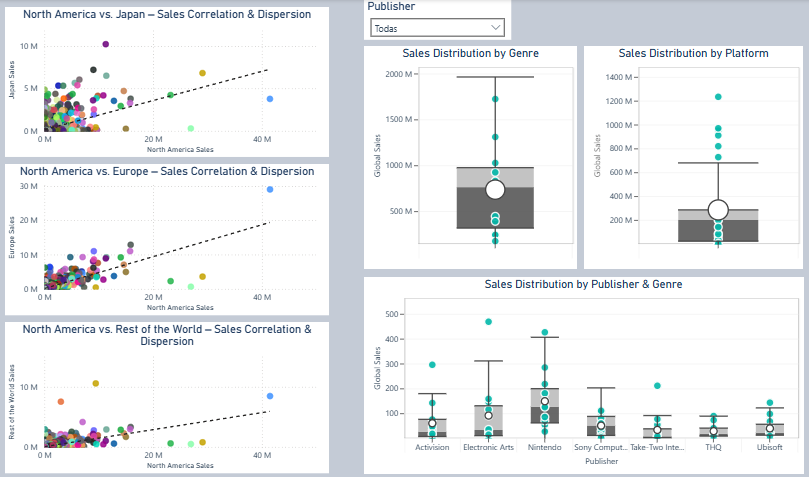
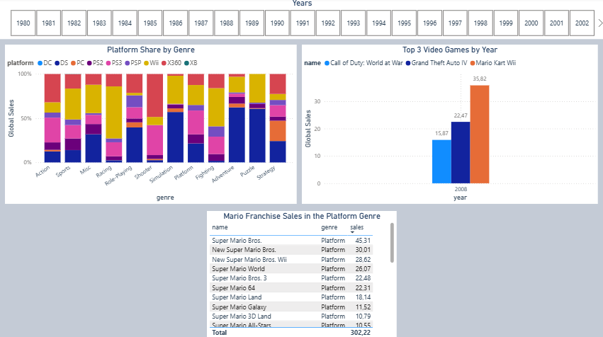

# Global Video Game Sales Analysis (1980–2020)

## 📑 Table of Contents
1. [Objective](#1-objective)  
2. [Executive Summary](#2-executive-summary)  
3. [Worldwide Insights](#3-worldwide-insights)  
4. [Regional Breakdown](#4-regional-breakdown)  
5. [Trends Over Time](#5-trends-over-time)  
6. [Variability & Outliers](#6-variability--outliers)  
7. [Conclusions & Recommendations](#7-conclusions--recommendations)  
8. [Additional Insights](#8-additional-insights)  

---

## 1. Objective
The primary objective of this report is to comprehensively analyze global video game sales from 1980 to 2020, identifying key patterns and trends by region, platform, genre, and franchise, to extract actionable insights that support strategic decisions in product development, marketing, and market expansion.

---

## 2. Executive Summary  
  

- **Total Video Game Sales:** A total of 8,820.36 million units sold worldwide between 1980 and 2020.  
- **Top-Selling Region:** North America leads with 4,333.43 million units (49.15 %).  
- **Best-Selling Platform:** PlayStation 2 tops at 1,233.46 million units.  
- **Top-Selling Game:** *Wii Sports* with 82.74 million units sold (2006 release).  
- **Peak Sales Year:** 2008 saw the highest annual sales at 678.90 million units.

---

## 3. Worldwide Insights  
  

**Top 10 Platforms by Global Sales**  
- PlayStation 2: 1,233.46 M; Xbox 360: 969.61 M; PlayStation 3: 949.35 M.  
- Sony also places PS1, PSP, and PS4 in the top 10.

**Top Video Game Titles by Global Sales**  
- *Wii Sports*: 82.74 M vs. *Grand Theft Auto V*: 55.92 M.  
- 70 % of top titles are Nintendo franchises.  
- Take-Two Interactive and Activision appear with one and two titles, respectively.

**Top 10 Publishers by Global Revenue**  
- Nintendo: 1,784.43 M; Electronic Arts: 1,093.39 M; Activision: 721.41 M.  
- 41.44 % of Nintendo’s revenue from DS and Wii; 54.68 % of EA’s from PlayStation platforms.

**Sales by Genre + Global Average Line**  
- Action: 1,722.88 M (19.53 % share).  
- Platform: 5th by total but highest average per title (0.95 M).  
- Pre-2004, Platform led thanks to Mario (36.44 % of its genre).

**Methodology**  
- Chart: Table  
- Columns: `name`, `genre`, `sales`

---

## 4. Regional Breakdown  
  

**Global Sales Share by Region**  
- North America: 49.15 %  
- Europe: 27.33 %  
- Japan: 14.57 %  
- Rest of World: 8.95 %

**Publisher Sales by Region**  
- North America & Europe: Nintendo, EA, Activision, Sony, Ubisoft.  
- Japan: Nintendo, Bandai Namco, Konami, Sony, Capcom.  
- Rest of World mirrors NA/EU but with EA leading and Take-Two replacing Ubisoft.

**Sales by Genre & Region**  
- NA leads all genres except RPG (Japan leads).  
- Shooter least popular in Japan.  
- Action tops in NA/EU/Rest; RPG in Japan; Strategy the weakest globally.

---

## 5. Trends Over Time  
  

**Regional Share Over Time**  
- NA vs. JP swapped lead until 1995; NA dominated from 1996–2015.  
- Europe overtook Japan after 1997, peaking at 37.76 % in 2016 vs. NA’s 31.97 %.

**Platform Sales Over Time**  
- Top five platforms launched post-2000.  
- PS2 led 2000–2005; Wii dominated 2006–2009; Xbox 360 and PS3 led in their eras.  
- DS peaked in 2007 at 298.38 M units.

**Sales Fluctuation of the Four Best-Selling Genres**  
- Golden era: 2005–2011.  
- PS2 launch in 2000 drove genre trends: 2005 shares—Action 36.23 %, Sports 37.63 %, Shooter 30.07 %, RPG 17.40 %.  
- Sports peaked in 2006 & 2009 (Wii hits).  
- Shooter led 2007–2015 (Call of Duty).  
- RPG grew steadily since 1996 (Pokémon).  
- Action peaked in 2009 via diverse portfolio.

**Methodology**  
- Chart 1: 100 % stacked column  
  - Legend: Platform  
  - X-axis: Genre  
  - Y-axis: Sum of Global Sales  
  - Slicer: Year  
- Chart 2: Clustered column  
  - Legend: Name  
  - X-axis: Year  
  - Y-axis: Sum of Global Sales  
  - Slicer: Year

---

## 6. Variability & Outliers  
  

**North America vs. Japan – Correlation & Dispersion**  
- Low correlation: culture-specific hits (Pokémon vs. Duck Hunt).  
- Japan favors RPG; North America favors Shooter.

**North America vs. Europe – Correlation & Dispersion**  
- High correlation with few outliers.

**North America vs. Rest of World – Correlation & Dispersion**  
- Moderate correlation; Duck Hunt as a NA-specific outlier.

**Sales Distribution by Genre**  
- IQR: 658.83 on 1549.45 range (42.46 %), indicating high central dispersion.  
- No outliers; median (762.19) > mean (735.03) due to low-sales tail.

**Sales Distribution by Platform**  
- Six outliers (e.g. PS2: 1233.46) exceed upper whisker (679.01).  
- Mean (284.53) > median (200.05) due to mega-hits.  
- 75 % of platforms ≤ 284.90 M units.

**Sales Distribution by Publisher & Genre**  
- Action & Sports show publisher outliers from mega-hits.  
- Sony: symmetric (median = mean, IQR covers 70 % of range).  
- Other publishers skewed by top-selling titles.

---

## 7. Conclusions & Recommendations

### Conclusions
- North America leads with 49.15 % of global sales; Europe 27.33 %; Japan 14.57 %.  
- PS2 is the top console at 1233.46 M units (13.98 %).  
- Action is the leading genre (19.53 %); RPG shows continued growth.  
- Peak in 2008: 678.90 M units; decline post-2016 due to mobile and free-to-play.  
- High variability (CV > 300 %) indicates a polarized market: few mega-hits vs. long tail.

### Recommendations
- Prioritize marketing for high-growth genres and regions.  
- Replicate business models of consistently performing titles.  
- Implement ML forecasting models for regional and platform sales.

---

## 8. Additional Insights  
  

**Platform Share by Genre**  
Shows platform share within each genre over time, complementing genre fluctuation analysis.

**Top 3 Video Games by Year**  
Highlights the top three titles each year; tracks Call of Duty’s 2007–2015 dominance.

**Mario Franchise Sales in the Platform Genre**  
Table confirming Mario’s 36.44 % share of Platform genre sales.

