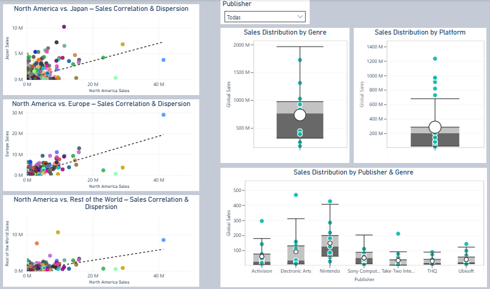

#Analysis
# Global Video Game Sales Analysis (1980–2020)

## 📑 Table of Contents
1. [Objective](#1-objective)  
2. [Executive Summary](#2-executive-summary)  
3. [Worldwide Insights](#3-worldwide-insights)  
4. [Regional Breakdown](#4-regional-breakdown)  
5. [Trends Over Time](#5-trends-over-time)  
6. [Variability & Outliers](#6-variability--outliers)  
7. [Conclusions & Recommendations](#7-conclusions--recommendations)  
8. [Additional Insights](#8-additional-insights)  

---

## 1. Objective
The primary objective of this report is to comprehensively analyze global video game sales from 1980 to 2020, identifying key patterns and trends by region, platform, genre, and franchise, to extract actionable insights that support strategic decisions in product development, marketing, and market expansion.

---

## 2. Executive Summary  
  

- **Total Video Game Sales:** A total of **8,820.36 million** video game units have been sold worldwide from 1980 through 2020.  
- **Top-Selling Region:** North America leads with **4,333.43 million** units sold, **accounting for 49.15 % of global sales**.  
- **Best-Selling Platform:** The PlayStation 2 is the highest-selling platform in history, with **1,233.46 million** units.  
- **Top-Selling Game:** *Wii Sports* is the best-selling game ever, moving **82.74 million** units since its 2006 release.  
- **Global Sales Over Time (1980–2020):** Annual sales peaked in **2008** at **678.90 million** units.  
## 3. Worldwide Insights

  

**Top 10 Platforms by Global Sales**  
- The all-time best-selling platform is the PlayStation 2 with **1,233.46 million** units, followed by the Xbox 360 (**969.61 million**) and the PlayStation 3 (**949.35 million**).  
- Sony also places the original PlayStation, the PSP, and the PlayStation 4 in the top 10, making it the company with the most entries.

**Top Video Game Titles by Global Sales**  
- *Wii Sports* leads with **82.74 million** units sold, significantly ahead of *Grand Theft Auto V* at **55.92 million**.  
- 70 % of the titles in this list are Nintendo franchises.  
- Take-Two Interactive and Activision round out the chart with one and two titles, respectively.

**Top 10 Publishers by Global Revenue**  
- Nintendo sits atop with **1,784.43 million**, followed by Electronic Arts (**1,093.39 million**) and Activision (**721.41 million**).  
- 41.44 % of Nintendo’s revenue comes from the DS and Wii platforms.  
- 54.68 % of EA’s revenue is generated by PlayStation devices.

**Sales by Genre + Global Average Line**  
- **Action** tops at **1,722.88 million** units, representing **19.53 %** of global sales.  
- **Platform** ranks fifth in total volume but leads in average sales per title (**0.95 million**).  
- Until 2004, Platform was the best-selling genre, driven by the Mario franchise, which accounts for **36.44 %** of its sales.

**Methodology**  
To supplement these visuals, I also used:  
- **Chart type:** Table  
- **Columns:** `name`, `genre`, `sales`  

---

## 4. Regional Breakdown

  

**Global Sales Share by Region**  
- North America accounts for **49.15 %** of global video game sales—nearly half of the industry’s historical total.  
- Europe, Japan, and the Rest of World represent **27.33 %**, **14.57 %**, and **8.95 %** of global sales, respectively.

**Publisher Sales by Region**  
- In North America and Europe, the top publishers are Nintendo, Electronic Arts, Activision, Sony Computer Entertainment, and Ubisoft—showing how similar these two markets are.  
- In Japan, the leading five are Nintendo, Bandai Namco, Konami Digital Entertainment, Sony Computer Entertainment, and Capcom, reflecting strong local preferences.  
- The Rest of World mirrors the North American/European ranking, except Electronic Arts is first and Take-Two Interactive replaces Ubisoft.

**Sales by Genre & Region**  
- North America leads every genre except Role-Playing, where Japan takes the top spot.  
- Shooter is the least popular genre in Japan, despite ranking third globally.  
- Action is the most popular genre in Europe, North America, and the Rest of World; Role-Playing leads in Japan. Strategy is the weakest genre across Europe, North America, and the Rest of World.  

---

## 5. Trends Over Time

  

**Regional Share of the Global Market**  
- Japan and North America were neck-and-neck for the top spot between 1980 and 1995.  
- From 1996 to 2015, North America led in annual sales every year.  
- Since 1997, Europe overtook Japan and held the second spot—reaching its peak in 2016 with **37.76 %** market share, ahead of North America’s **31.97 %**.

**Platform Sales Over Time**  
- The five best-selling platforms of all time launched after the year 2000.  
- PlayStation 2 dominated from 2000 to 2005.  
- In 2006, Nintendo Wii launched and took the top spot that same year—and again in 2007, 2008, and 2009.  
- Xbox 360 and PlayStation 3, released in 2005 and 2006 respectively, took turns leading: Xbox 360 in 2010 and 2015; PS3 from 2011 to 2014.  
- The Nintendo DS, launched in 2004, peaked in 2007 with **298.38 million** units sold.

**Sales Fluctuation of the Four Best-Selling Genres**  
- The peak years for Action, Sports, Shooter, and Role-Playing genres were between **2005–2011**, considered the golden age of gaming.  
- Trendlines rise post-2000, influenced by the arrival of PlayStation 2, which in 2005 alone accounted for:  
  - **36.23 %** of Action sales  
  - **37.63 %** of Sports sales  
  - **30.07 %** of Shooter sales  
  - **17.40 %** of Role-Playing sales  
- **Sports** peaked in 2006 and 2009, driven by the success of the Nintendo Wii and titles like *Wii Sports*, *Wii Sports Resort*, and *Wii Fit Plus*.  
- **Shooter** sales surged between 2007 and 2015, thanks to the *Call of Duty* franchise, which consistently ranked in the global top 3.  
- **Role-Playing** began trending upward as early as 1996 due to *Pokémon*’s explosion in popularity.  
- **Action** hit its highest point in 2009, not because of a single blockbuster, but a wide variety of well-performing titles.

**Methodology**  
To support this analysis, the following visuals and setups were used:

- *Chart 1: 100% Stacked Column Chart*  
  - Legend: `platform`  
  - X-Axis: `genre`  
  - Y-Axis: `Sum of Global Sales`  
  - Slicer: `year`  

- *Chart 2: Clustered Column Chart*  
  - Legend: `name`  
  - X-Axis: `year`  
  - Y-Axis: `Sum of Global Sales`  
  - Slicer: `year`

**Global Sales Trend Over Time**  
- Early years saw relatively low sales due to the industry's nascency.  
- **Golden Era (2005–2011):** Peak year was **2008** with **678.49 million** units sold.  
- From 2015 onwards, sales declined sharply—from **264.26 M** in 2015 to **70.87 M** in 2016.  
  This drop is likely linked to the rise of mobile and free-to-play games like *Candy Crush* and *PUBG Mobile*.

  ---

  ## 6. Variability & Outliers  
  

**Sales Correlation: North America vs. Japan**  
- The points are scattered and do not follow a clear linear pattern, indicating **little to no correlation** between sales in North America and Japan.  
- Some games were **massive in Japan** but underwhelming in North America (*e.g., Pokémon Red/Blue, Pokémon Diamond/Pearl*), while others did well only in North America (*e.g., Duck Hunt, Wii Sports*).  
- **Cultural preferences** likely play a major role — Japanese audiences tend to favor **Role-Playing** games, whereas North American audiences show broader tastes with a strong lean toward the **Shooter** genre.

**Sales Correlation: North America vs. Europe**  
- Sales in North America and Europe exhibit a **stronger correlation**, with most points clustered around the trendline.  
- The general pattern shows **similar market preferences**, where success in one region often mirrors success in the other.

**Sales Correlation: North America vs. Rest of World**  
- The correlation here is **moderate** — stronger than with Japan, but **weaker than with Europe**.  
- The chart contains **more outliers**, including *Duck Hunt*, which appears as an anomaly in all three comparisons — suggesting it was primarily a **North American phenomenon**.  
- Once again, cultural differences are a likely factor. While **North America favors Shooters**, regions like Japan lean towards **Role-Playing and Platform** titles.

**Sales Distribution by Genre**  
- **Interquartile Range (IQR):** 658.83  
- **Total Range:** 1549.45  
- The IQR represents **42.46 %** of the total range, indicating **high central dispersion** in genre sales.  
- There are **no outliers** in the genre distribution — even the top-selling genre (*Action*, with 1722.48M) falls within expected variability.  
- **Mean:** 735.03 | **Median:** 762.19  
- The **slightly lower mean** suggests the presence of **lower-selling genres** pulling the average down.

**Sales Distribution by Platform**  
- There are **6 outlier points** — platforms with exceptionally high sales (e.g., 1233.46M, 969.61M), well above the upper whisker.  
- **Mean:** 284.53 | **Median:** 200.05  
- The **significant gap** between the mean and median indicates a **right-skewed distribution** due to blockbuster platforms like **PS2** and **X360**.  
- **75 % of platforms** sold **≤ 284.90M**, highlighting the dominance of a few market leaders over a broad base of underperformers.

**Sales Distribution by Publisher & Genre**  
- Some publishers achieved **genre-level sales outliers**, especially in **Action, Sports**, and **Shooter**.  
- **Sony Computer Entertainment** shows a **symmetric distribution** with mean ≈ median and an IQR that covers **70 % of the total range**, suggesting a **well-balanced sales performance**.  
- Other publishers (e.g., Nintendo, EA) have a **mean significantly higher than the median**, pointing to **skewed distributions** driven by **massive hits**.

---

## 7. Conclusions & Recommendations  

  

### **Conclusions**  

After analyzing over **8,800 million units** sold from multiple perspectives —regional, temporal, by genre, and by platform— the key insights are:

- **North America** leads the market with **49.15 %** of global video game sales, followed by **Europe (27.33 %)** and **Japan (14.57 %)**.  
- The **PlayStation 2** is the most successful console of all time, with **1,233.46 million** units sold — representing **13.98 %** of all-time sales.  
- **Action** is the top-selling genre (**19.53 %** of global sales), while **Role-Playing** shows steady growth thanks to franchises like *Pokémon*.  
- Global sales **peaked in 2008** at **678.90 million** units. Since 2016, a **declining trend** has emerged, likely due to the rise of **mobile and free-to-play games**.  
- Sales dispersion across regions shows **coefficients of variation above 300 %**, indicating a **polarized market**: a few mega-hits dominate, while most titles show moderate performance.

---

### **Recommendations**  

To support data-informed decision-making:

- **Prioritize investment** in the fastest-growing **genres and regions**.  
- **Replicate business models** from titles with **low variability and consistent performance**.  
- **Implement predictive models** to forecast sales by market and platform, improving strategic planning and return on Investment.  

These approaches enable **targeted, high-impact decisions** in an increasingly competitive and dynamic gaming industry.

--- 

## 8. Additional Insights

Supplementary visuals providing deeper context and validation for previous analyses:  

  

---

### **Platform Share by Genre**  
This stacked chart shows the **annual percentage share** of each platform within every video game genre. It was used to **complement the analysis of the "Sales Fluctuation of the Four Best-Selling Genres" chart**, by answering key questions such as:
- What proportion of **Action, Sports, Shooter,** or **Role-Playing** sales came from **PlayStation 2**?
- How dominant was the **Nintendo Wii** within the **Sports** genre?

---

### **Top 3 Video Games by Year**  
This visual displays the **three best-selling games for each year** from 1980 to 2020. It helped reinforce conclusions drawn in the **"Sales Fluctuation of the Four Best-Selling Genres"** section, especially:
- The persistent dominance of the **Call of Duty** franchise, which appeared in the global top 3 **every year from 2007 to 2015**.

---

### **Mario Franchise Sales in the Platform Genre**  
This table quantifies the **impact of the Mario franchise** within the **Platform** genre. It served to support the analysis in the **"Sales by Genre + Global Average Line"** section.  
Key takeaway:
- **Mario accounts for 36.44 %** of all Platform genre sales globally—highlighting its foundational role in that category.

